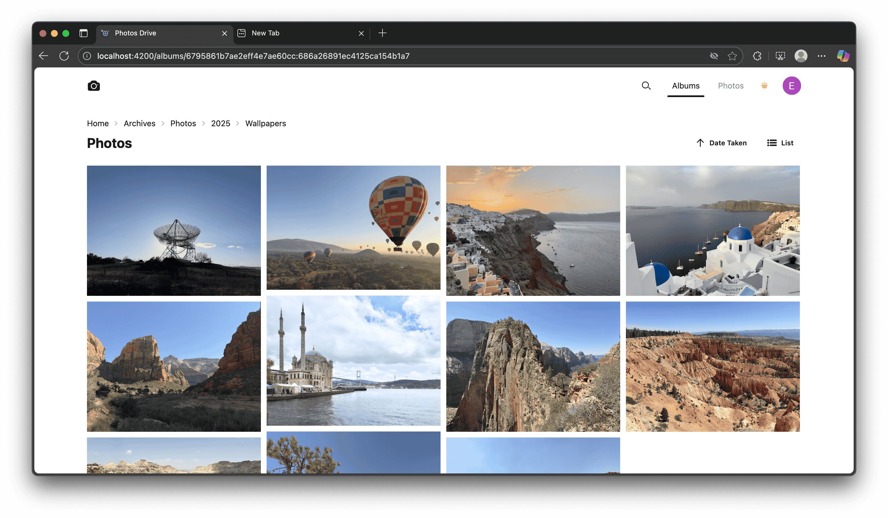
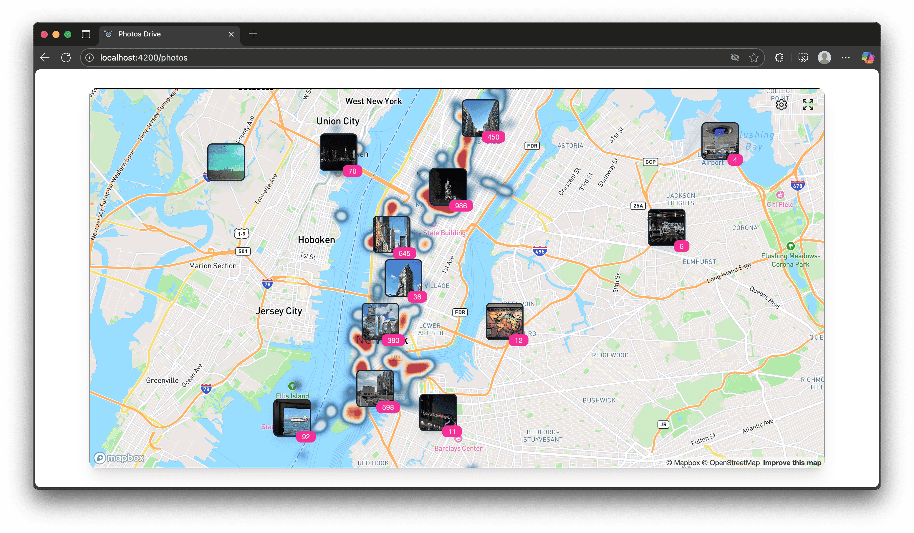
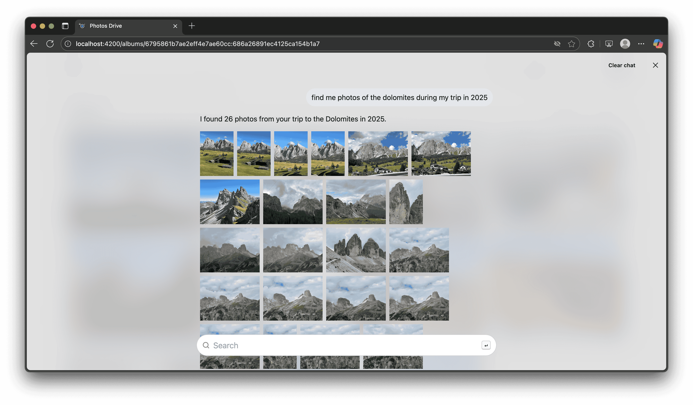

# Photos Drive

> Your unified photo hub — sync, browse, and search your photos with AI.

Photos Drive is a photo management platform that connects and displays all your photos across different storage solutions in one place.

It syncs and uploads photos from your computer to configured databases and photo storage accounts using a CLI tool. A web UI then presents your photos in a list or map view, organized by nested albums that reflect the folder structure on your computer.

## Features

- [x] **Upload photos** directly to Google Photos from the CLI or the Photos Drive Python library.
- [x] **Sync & compare** local vs cloud photos with the CLI.
- [x] **Integrate easily** with other systems using the Photos Drive Python package.
- [x] **Browse albums and folders** in a simple Web UI.
- [x] **View photos efficiently** with lazy loading and pagination.
- [x] **Secure login** to the Web UI using Google OAuth2.
- [x] **Explore photos on a map** to see where they were taken.
- [x] **AI-powered search** with Gemini + CLIP: find photos by objects, places, or descriptions.

## Walkthrough

Refer to [this doc](docs/walkthrough.md) for a detailed walkthrough. Here are a few example views:

## Installation

Refer to the [setup guide](./docs/setup.md) to learn how to set up your own Photos Drive system.

## Internal Documentation

See the [internal documentation guide](./docs/internal/toc.md) for details on the project setup.

## Disclaimer

This project is intended **for educational purposes only** and **not for commercial use**. The maintainers disclaim all liability for damages or data loss resulting from the use of this software.

## License

Photos Drive is licensed under the **GNU General Public License (GPL)**.
Please refer to the `LICENSE.txt` file in the root of this repository for full license details.

---

Thank you for checking out Photos Drive!
Contributions, bug reports, and feature requests are welcome via GitHub issues and pull requests.
