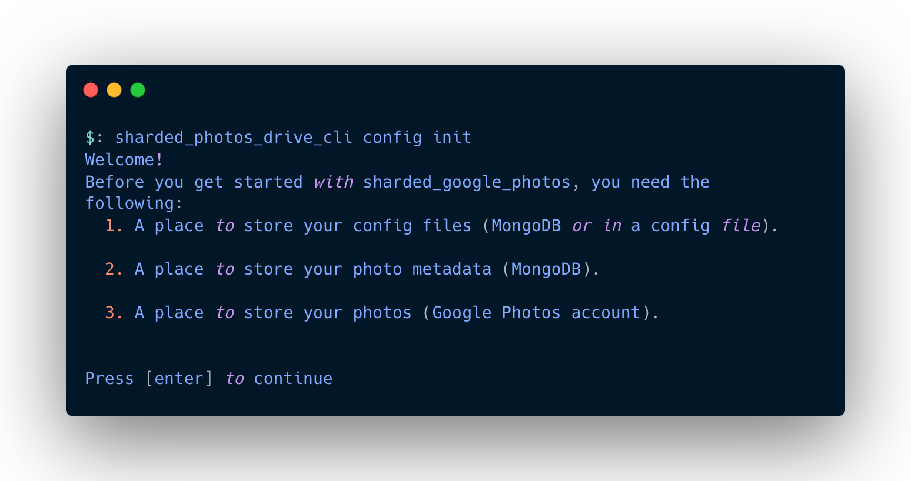
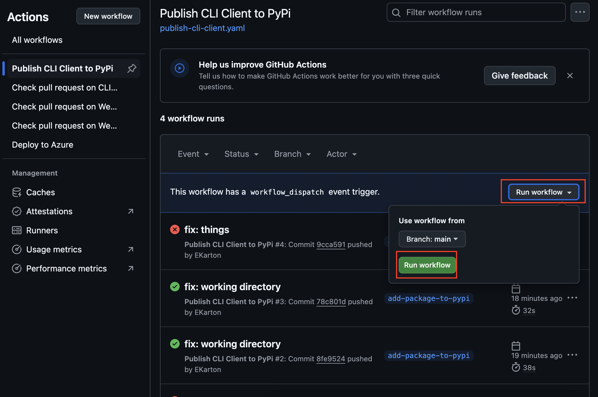

# Sharded-Photos-Drive-CLI-Client

## Description

The Sharded-Photos-Drive-CLI-Client is the cli client for Sharded Photos Drive. This CLI helps set up your infrastructure, syncs, adds, and delete your pictures and videos from your machine to Sharded Photos Drive.

This CLI will never delete content from your machine - it should only mirror the content from your machine to the cloud.

## Getting Started

### Installation

1. First, install the package by running:

   ```bash
   pip3 install sharded_photos_drive_cli_client
   ```

### Setting up your infrastructure

1. Next, to set up your infrastructure by running `sharded_photos_drive_cli_client config init`.

2. It will ask you information on what the command will do:

   

   Press `[enter]` to continue.

3. Next, the cli will prompt you to specify a place to store the configs. You can store it locally or on MongoDB.

   For simplicity, select `2`. It will then ask you to enter the file name of your config.

   

4. Next, it will ask you to add a MongoDB database to store your pictures / videos metadata. It will prompt you to enter a name for your first database, and its read-write connection string:

   ```terminal
   First, let's log into your first Mongo DB account.
   Enter name of your first Mongo DB account: 
   ```

5. Finally, it will ask you to add your Google Photos account to store your pictures / videos. It will prompt you to enter a name for your first Google Photos account, and a Google Photos Client ID and Google Photos Client Secret.

6. After specifying the name, client ID, and client secret, it will return a URL to authenticate. Copy-paste the URL to your browser and follow the instructions on the browser:

## Getting Started to Contribute

1. Ensure Python3, Pip, and Poetry are installed on your machine

2. Install dependencies by running:

   ```bash
   poetry install
   ```

3. To lint your code, run:

   ```bash
   poetry run mypy . --check-untyped-defs && poetry run flake8 && poetry run black .
   ```

4. To run tests and code coverage, run:

   ```bash
   poetry run coverage run -m pytest && poetry run coverage report -m
   ```

5. To run tests and code coverage, run:

   ```bash
   poetry run coverage run -m pytest <insert-file-path> && poetry run coverage report -m
   ```

   For example,

   ```bash
   poetry run coverage run -m pytest tests/backup/test_backup_photos.py && poetry run coverage report -m
   ```

6. To publish a new version of the app:

   1. First, bump up the package version by running:

      ```bash
      poetry version [patch|minor|major]
      ```

      For instance, if the app is on 0.1.0 and you want to increment it to version 0.1.1, run:

      ```bash
      poetry version patch
      ```

   2. Then, create a pull request with the new version number.

   3. Once the pull request is submitted, go to <https://github.com/EKarton/Sharded-Photos-Drive/actions/workflows/publish-cli-client.yaml>, click on the `Run workflow`, ensure that it's on the `main` branch, and click on `Run workflow`:

      

   4. Once the action is complete, it will publish a new version of the app on <https://pypi.org/project/sharded_photos_drive_cli_client/>.

### Usage

Please note that this project is used for educational purposes and is not intended to be used commercially. We are not liable for any damages/changes done by this project.

### Credits

Emilio Kartono, who made the entire project.

CLI images were provided by <https://carbon.now.sh/>.

### License

This project is protected under the GNU licence. Please refer to the root project's LICENSE.txt for more information.
