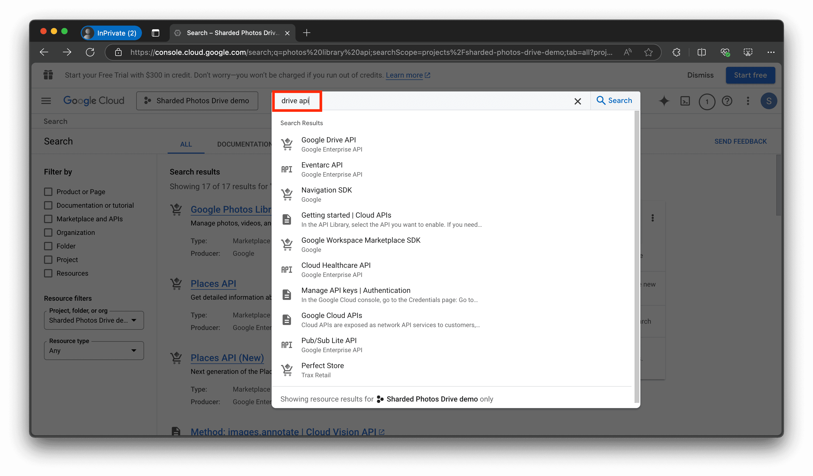

# Create your Google OAuth2 Client for Google Photos

## Description

This guide outlines how to create your Google OAuth2 client so that you can store your photos on Google Photos.

By the end of this guide, you will have created the OAuth2 client, and have obtained the client ID and client secrets so that the CLI can interact with the Google Photos and Google Drive APIs.

## Steps

1. Go to <https://cloud.google.com/cloud-console> and log into your Google account
2. Click on the "Console" button:

    

3. Click on the "Select Project" button and create a new project with any name:

    

    

    

4. Wait for your project to be created. Then select your project again:

    

    

5. Type in "Photos Library Api" in the search box, select "Photos Library Api", and click on "Enable":

    

    

    

6. Similarly, enable the Drive API by typing in "Drive API" in the search box, select "Drive API", and click on "Enable":

    

    

    

7. Create a new OAuth2 Consent Screen by going to to the APIs and Services tab, creating an External API, and fill in the details:

    

    

    

    

    

8. No special scopes is needed. So we can click on the `Save and Continue` button:

    

9. In the Test Users page, click on `Save and Continue`. We don't need to add test users since we will publish the app:

    

10. In the "Summary" page, scroll down and click on `Back to Dashboard` button:

    

11. In the main consent page, click on `Publish App`. A dialog will appear. Click on `Confirm`. It will publish the app:

    

12. Create the Client IDs and client secrets by going to the "Credentials" tab, clicking on "Create Credentials", select "OAuth Client ID", selecting "Web Application", and adding `http://localhost:8080/` in the authorized redirect uri:

    

    

    

    

    

    

13. Finally, click on the `Create` button. A dialog will appear with your Client ID and Client secrets. Download the file named as `client_secrets.json` and you now have your own client ID and client secrets:

    
