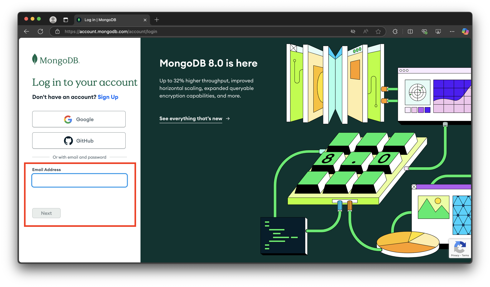
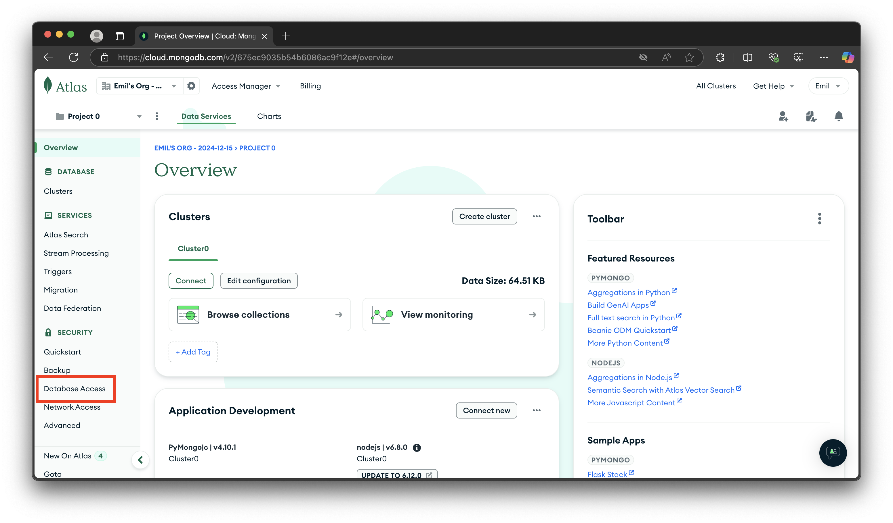
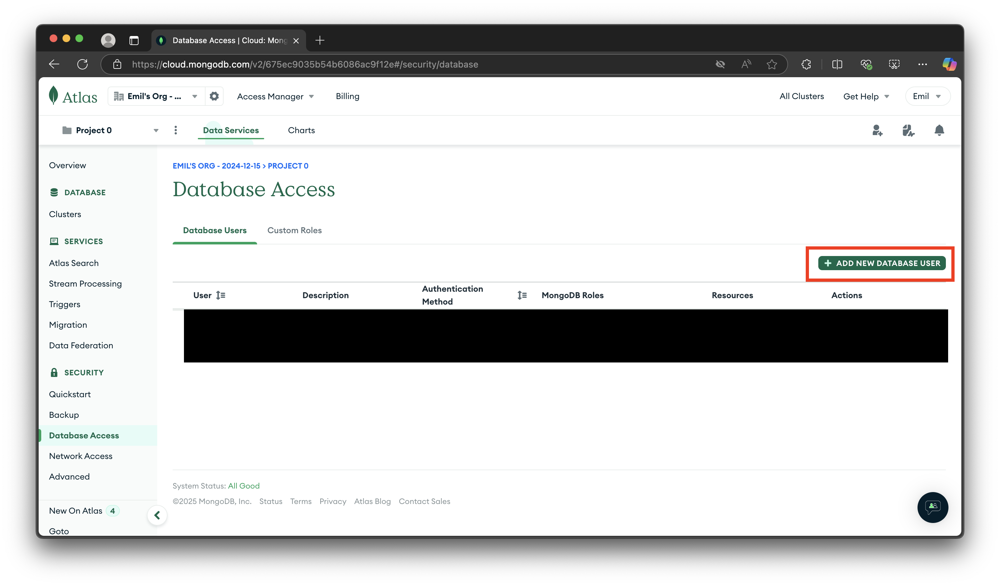
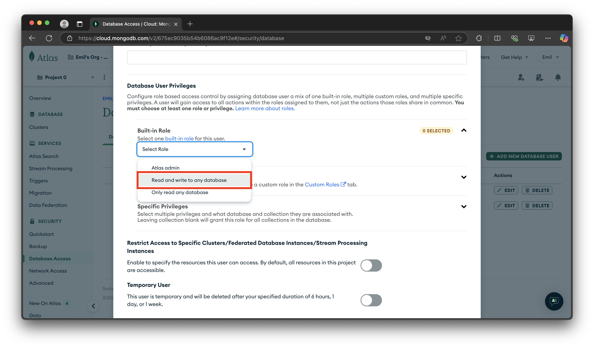
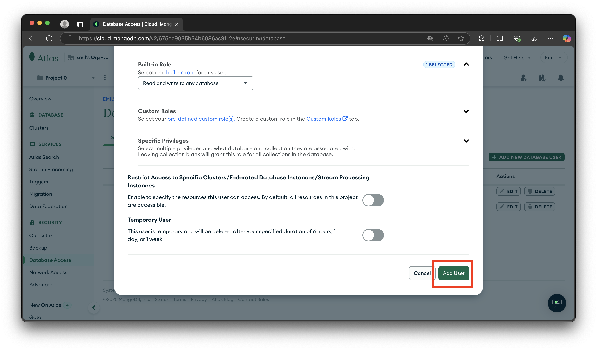
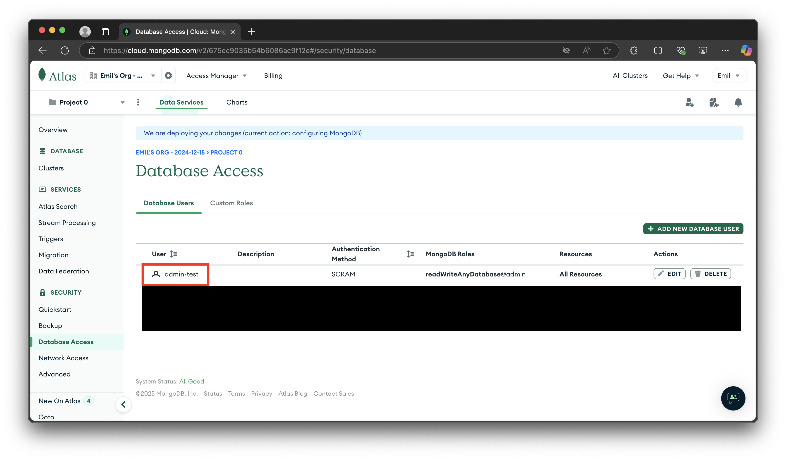
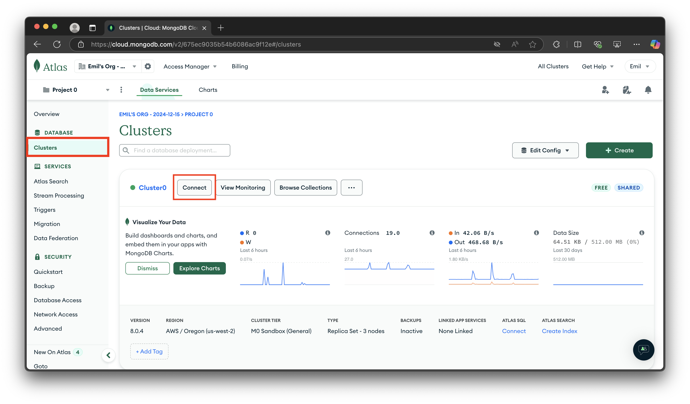
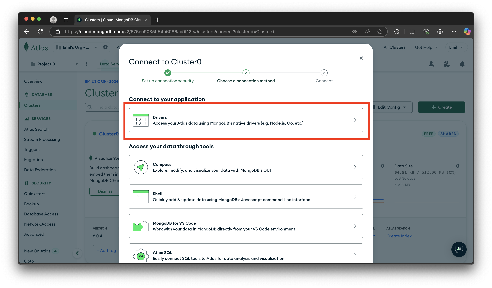
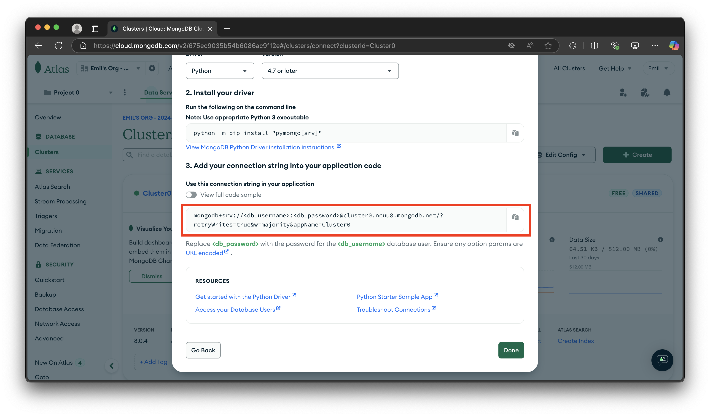

# Creating your MongoDB connection string

## Description

This document outlines how to create your own connection string to your MongoDB database so that you can interact with your database via its APIs

## Steps

1. Go to <https://www.mongodb.com>, click on the login button, and log into your MongoDB account:

    

    

2. Once you're logged in, go to the `Database Access` tab, and click on the `Add new database user` button:

    

    

3. A new window appears. Set the authentication method to `Password`, specify the user's name, and click on auto-generate password:

    

    Copy the password to a notepad (it will be used later).

4. Scroll down, and set the built-in role to `Read and write to any database`, and then click on `Add user`:

    

    

5. It should show your new user in the users list with read and write permissions:

    

6. Now, click to the `Clusters` tab and click on the `Connect` button:

    

7. Click on the `Drivers` button:

    

8. Scroll down, and you will see a connection string template. Replace `<db_username>` and `<db_password>` with the name of the user you have made from step 3, and the user's password.

    

9. All done! You have made your connection string for your new user.
