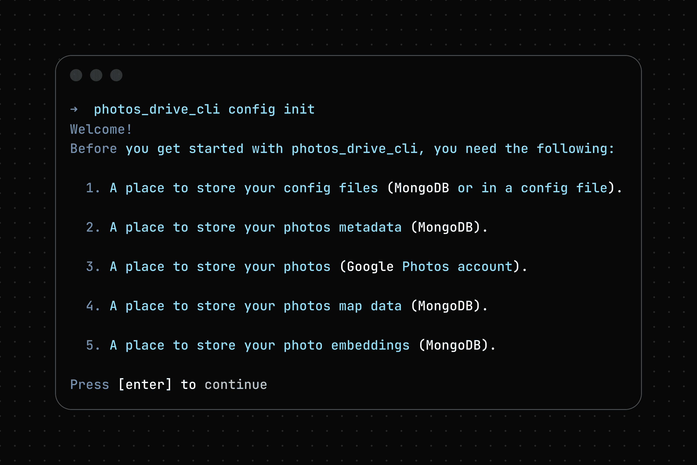
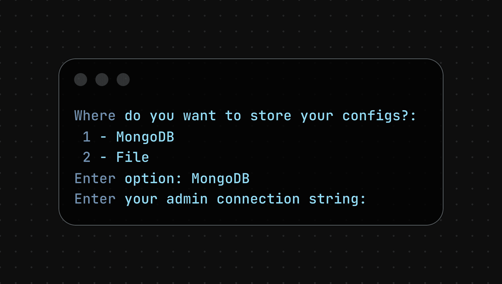
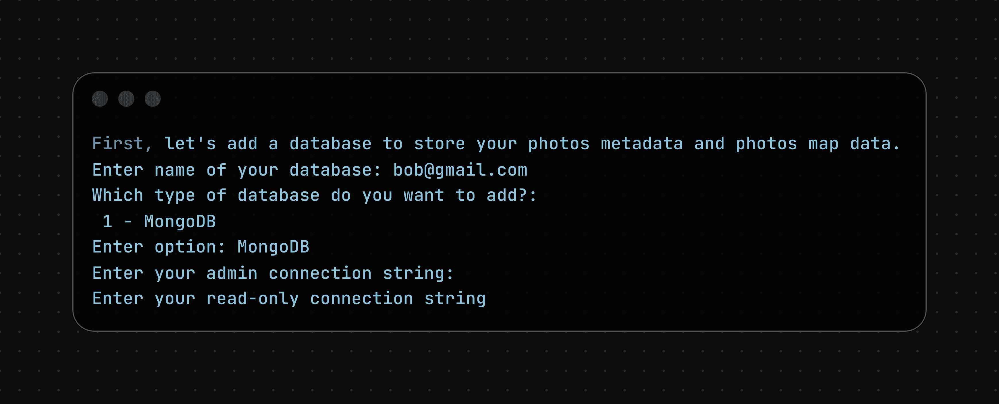
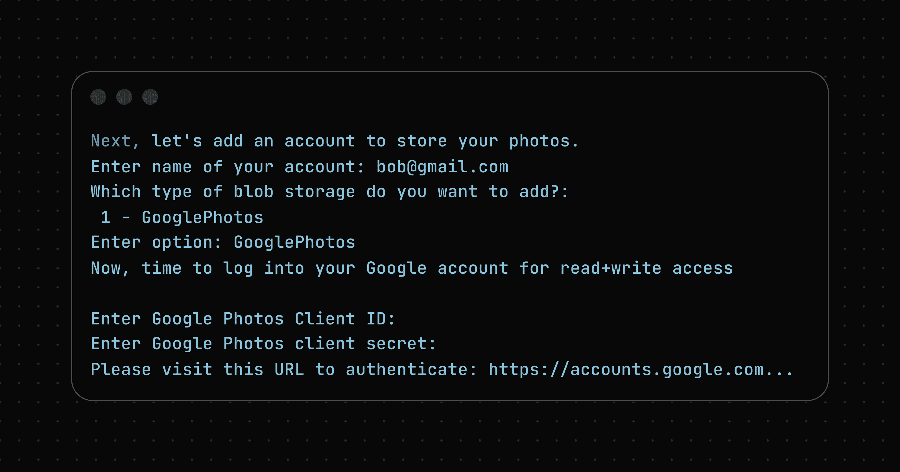
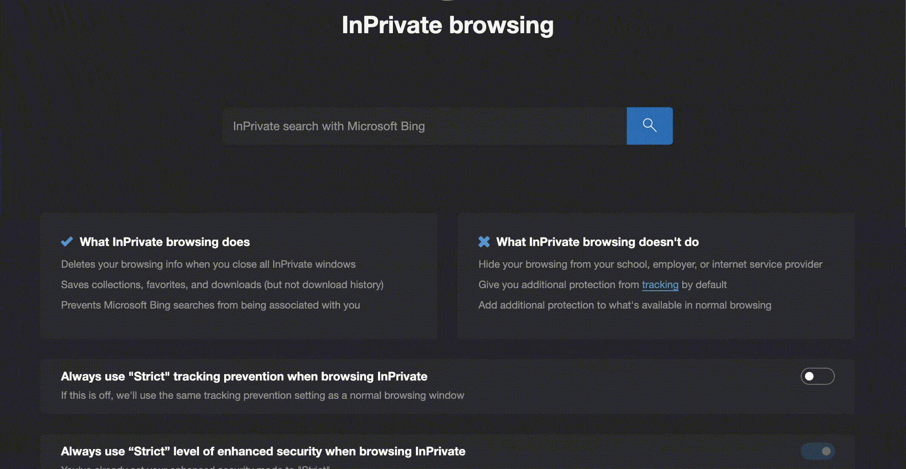
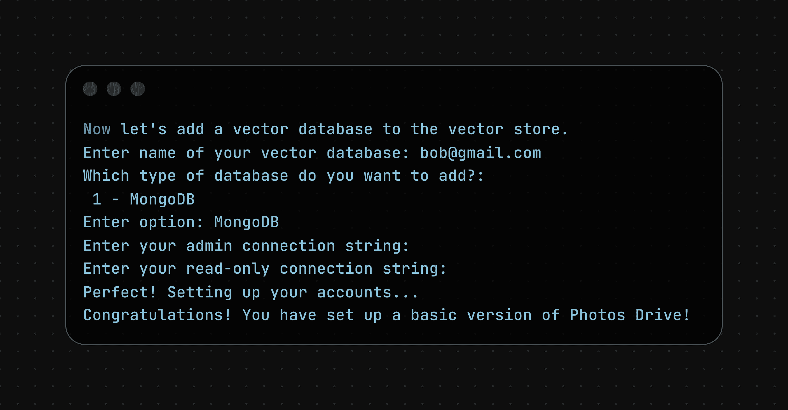
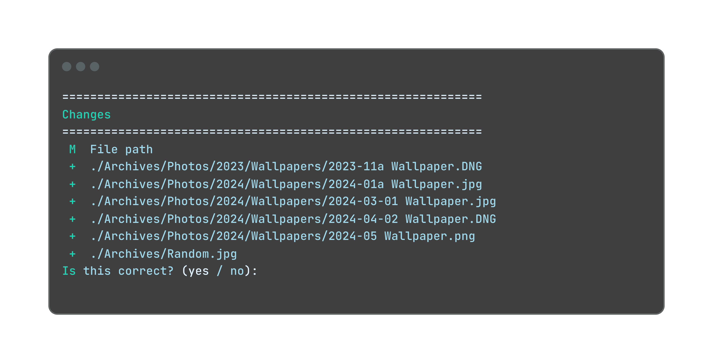
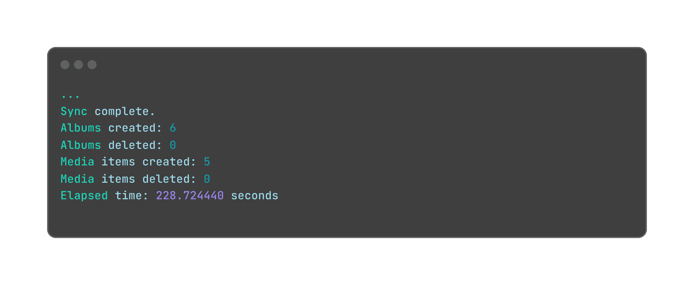
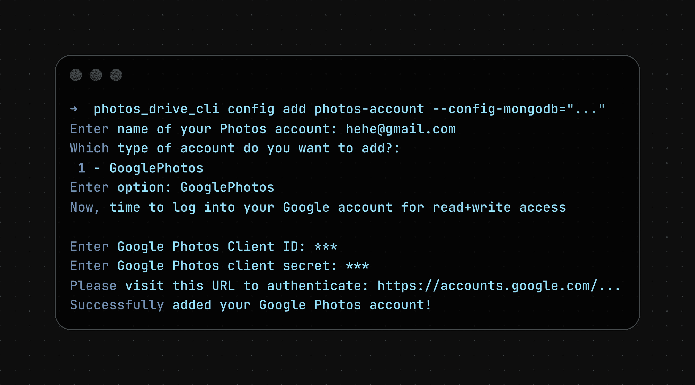
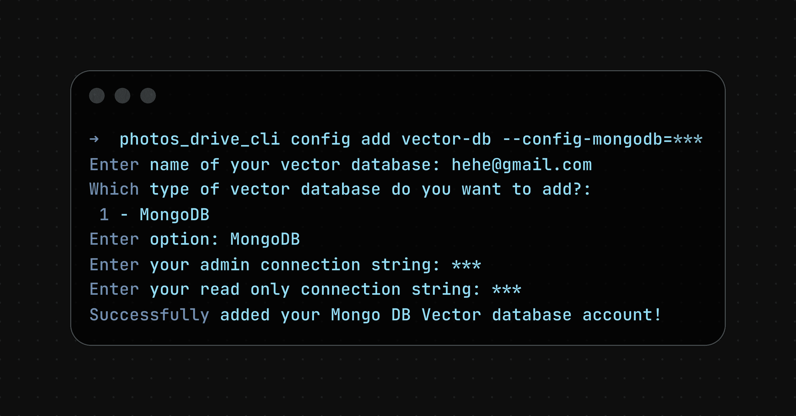

# Getting Started

This guide contains steps on how to get started with the Photos Drive CLI.

## Table of Contents

- [Installation](#installation)
- [Setting up your infrastructure](#setting-up-your-infrastructure)
- [Syncing your photos / videos](#syncing-your-photos--videos)
- [Adding custom content](#adding-custom-content-to-photos-drive)
- [Deleting custom content](#deleting-content-to-photos-drive)
- [Scaling up](#scaling-up-photos-drive)
- [Cleaning](#cleaning-photos-drive)
- [Deleting everything](#deleting-all-content-in-photos-drive)

## Pre-requisites

- [PyEnv](https://github.com/pyenv/pyenv?tab=readme-ov-file#installation)
- [Exiftool](https://exiftool.org/)

## Installation

1. Create a Python virtual environment using Python 3.12 and activate it by running:

   ```bash
   pyenv shell 3.12.11
   python3 -m venv .
   source bin/activate
   ```

1. Next, install this Python package from [PyPi](https://pypi.org/project/photos_drive/) by running:

   ```bash
   pip3 install photos_drive
   ```

## Setting up your infrastructure

1. First, you need to have the following:

   1. A MongoDB account

   1. A Google Photos account

1. First, run `photos_drive_cli config init`.

1. It will ask you information on what the command will do.

   

   Press `[enter]` to continue.

1. Next, the cli will ask you to specify a place to store the configs. You can store it either locally or on MongoDB. We will store it in `MongoDB`:

   1. First, follow [this guide](./store_config_on_mongodb.md) to get the config connection string to your MongoDB account

   1. Next, in the CLI, specify `MongoDB` as the config type.

   1. Finally, enter the connection string from the previous step to the CLI.

      

1. Then, it will ask you where to store your photos metadata / map data. Right now, we only support `MongoDB`, which we will store it in:

   1. First, follow [this guide](./store_metadata_on_mongodb.md) to get the admin connection string and the read-only connection string to your MongoDB database.

   1. Next, go back to the CLI. Enter the name for your database, enter `MongoDB` as the type of database, and the admin connection string and the read-only connection string to the database:

   

1. Finally, it will ask you to add an account to store your photos. Right now, we only support Google Photos, which we will store it in:

   1. First, follow [this guide](./create_google_oauth2_client.md) to create your Google OAuth2 client, and obtain the client ID and client secrets to your OAuth2 client.

   1. Go back to the CLI. Enter the name of your Google Photos account, enter `GooglePhotos` as the type of account, and the Google OAuth2 Client's client ID and client secret from the previous step.

      

   1. It will then return a URL to authenticate. Copy-paste the URL to your browser and follow the instructions on the browser:

      

1. Finally, add a vector database to your vector store. Right now, we only support MongoDB, which we will store it in:

   1. First, follow [this guide](./store_metadata_on_mongodb.md) to get the admin connection string and the read-only connection string to your MongoDB database. If you are re-using the MongoDB account from the previous 2 steps, you can ignore this step.

   1. Next, go back to the CLI. Enter the name for your database, enter `MongoDB` as the type of database, and the admin connection string and the read-only connection string to the database:

   

1. All done! You have successfully set up a basic instance of your Photos Drive.

## Syncing your photos / videos

1. From the previous step, assume you have your config in MongoDB, and assume your current working directory looks like this:

   ```bash
   .
   └──  Archives
       ├── Photos
       │   ├── 2023
       │   │   └── Wallpapers
       │   │       └── 2023-11a Wallpaper.DNG
       │   └── 2024
       │       └── Wallpapers
       │           ├── 2024-01a Wallpaper.jpg
       │           ├── 2024-03-01 Wallpaper.jpg
       │           ├── 2024-04-02 Wallpaper.DNG
       │           └── 2024-05 Wallpaper.png
       └── Random.jpg
   ```

1. To sync your photos / videos to the system, run:

   ```bash
   photos_drive_cli sync './Archives' Archives --config-mongodb="<YOUR_CONNECTION_STRING>"
   ```

   where `<YOUR_CONNECTION_STRING>` is the connection string to your MongoDB account containing the config.

1. It will then ask you to confirm if these are the contents that you want to upload to the system. Type in `yes`:

   

1. After a while, the contents should be uploaded and will output statistics on the upload.

   

1. If you want to sync your photos/videos in a particular path in the system, you can specify the `--remote_albums_path` field, like:

   ```bash
   photos_drive_cli sync './Archives' Archives  --config-mongodb="<YOUR_CONNECTION_STRING>"
   ```

   It will compare all contents under the local directory `./Archives` to all content under the albums path `Archives`.

1. Experimental: You can also upload photos / videos in parallel with the `--parallelize_uploads` flag, like:

   ```bash
   photos_drive_cli sync . --config-mongodb="<YOUR_CONNECTION_STRING>" --parallelize_uploads
   ```

## Adding custom content to Photos Drive

1. Suppose your Photos Drive has the following content:

   ```bash
   root
   └── Archives
       ├── Photos
       │   └── 2024
       │       └── Wallpapers
       │           ├── 2024-01a Wallpaper.jpg
       │           ├── 2024-03-01 Wallpaper.jpg
       │           ├── 2024-04-02 Wallpaper.DNG
       │           └── 2024-05 Wallpaper.png
       └── Random.jpg
   ```

   and you want to upload the current content in your working directory:

   ```bash
   .
   └── Current
       └── Dog.jpg
   ```

1. You can run:

   ```bash
   photos_drive_cli add ./Current --config-mongodb="<YOUR_CONNECTION_STRING>"
   ```

   where `<YOUR_CONNECTION_STRING>` is the connection string to your MongoDB account containing the config.

   Your system will add all contents under `./Current` without deleting any existing content in your system.

1. In other words, you will have these contents:

   ```bash
   root
   ├── Archives
   │   ├── Photos
   │   │   └── 2024
   │   │       └── Wallpapers
   │   │           ├── 2024-01a Wallpaper.jpg
   │   │           ├── 2024-03-01 Wallpaper.jpg
   │   │           ├── 2024-04-02 Wallpaper.DNG
   │   │           ├── 2024-05 Wallpaper.png
   │   └── Random.jpg
   └── Current
       └── Dog.jpg
   ```

## Deleting content to Photos Drive

> Note: The commands below **do not** delete any data from your machine. It only deletes data from the Photos Drive (in the cloud).

1. Similarly, if your system has this content:

   ```bash
   root
   └── Archives
       ├── Photos
       │   └── 2024
       │       └── Wallpapers
       │           ├── 2024-01a Wallpaper.jpg
       │           ├── 2024-03-01 Wallpaper.jpg
       │           ├── 2024-04-02 Wallpaper.DNG
       │           ├── 2024-05 Wallpaper.png
       └── Random.jpg
   ```

1. If you want to delete the `Archives/Random.jpg` picture from the Photos Drive, you can run:

   ```bash
   photos_drive_cli delete Archives/Random.jpg --config-mongodb="<YOUR_CONNECTION_STRING>"
   ```

   where `<YOUR_CONNECTION_STRING>` is the connection string to your MongoDB account containing the config.

   The photo `Archives/Random.jpg` will be deleted from the system.

1. Similarly, if you want to delete everything under the `Archives/Photos` album, you can run:

   ```bash
   photos_drive_cli delete Archives/Photos --config-mongodb="<YOUR_CONNECTION_STRING>"
   ```

   and the system will have these new contents:

   ```bash
   root
   └── Archives
       └── Random.jpg
   ```

## Scaling up Photos Drive

Suppose you are running out of space in your metadata store / maps store / vector store / photos store. You can increase the amount of space by adding additional databases / photo accounts to your Photos Drive.

### Adding photo accounts

1. Suppose you want to add a new Google Photos account. You can do so by running:

   ```shell
   photos_drive_cli config add photos-account --config_mongodb="<YOUR_CONNECTION_STRING>"
   ```

   where `<YOUR_CONNECTION_STRING>` is the connection string to your MongoDB account containing the config.

   It will ask you to enter your name for your account, the type of account (right now we only support Google Photos), and a Google Photos Client ID and Google Photos Client Secret:

   

1. After specifying the name, client ID, and client secret, it will return a URL to authenticate. Copy-paste the URL to your browser and follow the instructions on the browser:

   

### Adding databases to Photos Metadata and Photos Map store

1. Suppose you want to add a new database to metadata / maps store. You can do so by running:

   ```shell
   photos_drive_cli config add metadata-maps-db --config_mongodb="<YOUR_CONNECTION_STRING>"
   ```

   where `<YOUR_CONNECTION_STRING>` is the connection string to your MongoDB account containing the config.

1. It will prompt you to enter a name for your database, the type of database (right now we only support MongoDB), and its admin connection string and read-only connection string:

   

### Adding databases to Vector store

1. Suppose you want to add a new vector database to the Vector store. You can do so by running:

   ```shell
   photos_drive_cli config add vector-db --config_mongodb="<YOUR_CONNECTION_STRING>"
   ```

   where `<YOUR_CONNECTION_STRING>` is the connection string to your MongoDB account containing the config.

1. It will prompt you to enter a name for your database, the type of database (right now we only support MongoDB), and its admin connection string and read-only connection string:

   

## Cleaning Photos Drive

In case any of the `sync`, `add`, or `delete` commands fail, there are data that can be cleaned up. Moreover, when a photo / video is deleted, due to the limitations of the Google Photos API, it will remain in your Google Photos account.

Hence, the `clean` script is provided to clean up the system.

Running:

```bash
photos_drive_cli clean --config-mongodb="<YOUR_CONNECTION_STRING>"
```

will:

1. Delete all media items from the metadata database that is not being used
1. Delete all albums from the metadata database that is not being used
1. Move photos / videos in Google Photos that are not used to a special album called `To delete` where you can manually delete the content in your Google Photos account.

## Deleting all content in Photos Drive

In case you want to delete everything, you can run:

```bash
photos_drive_cli teardown --config-mongodb="<YOUR_CONNECTION_STRING>"
```

It will delete all photos / videos from your system, and move all photos / videos in your Google Photo accounts to their `To delete` albums.
