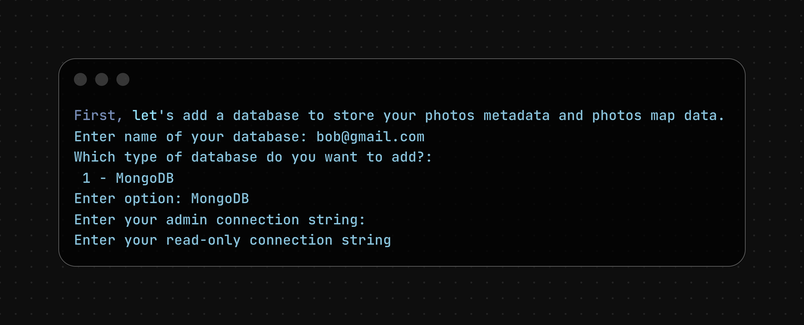
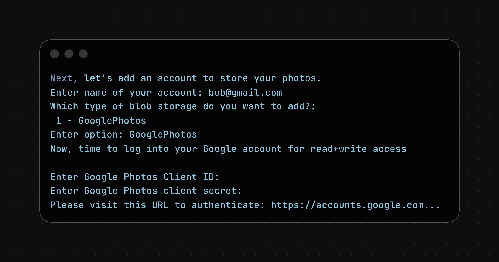
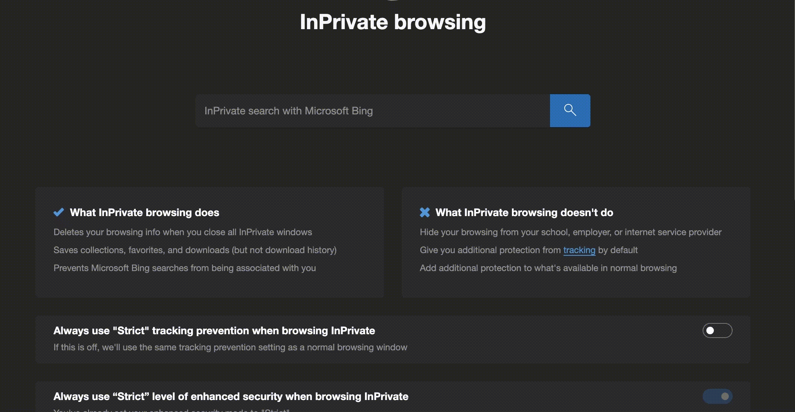
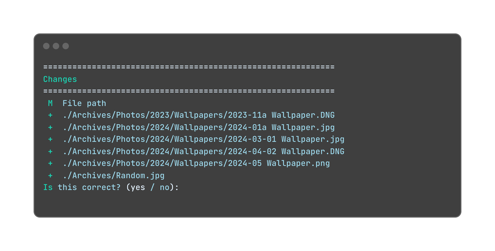
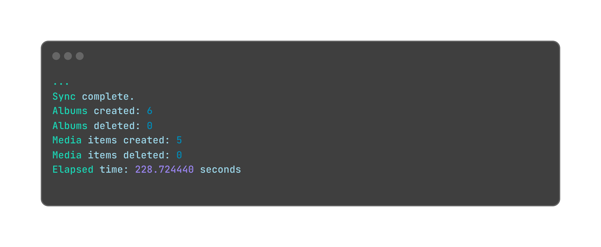

# Getting Started

This guide contains steps on how to get started with the Photos Drive CLI.

## Table of Contents

- [Installation](#installation)
- [Setting up your infrastructure](#setting-up-your-infrastructure)
- [Syncing your photos / videos](#syncing-your-photos--videos)
- [Adding custom content](#adding-custom-content-to-photos-drive)
- [Deleting custom content](#deleting-content-to-photos-drive)
- [Cleaning](#cleaning-trailing-photos-drive)
- [Deleting everything](#deleting-all-content-in-photos-drive)

## Pre-requisites

- [PyEnv](https://github.com/pyenv/pyenv?tab=readme-ov-file#installation)
- [Exiftool](https://exiftool.org/)

## Installation

1. Create a Python virtual environment using Python 3.12 and activate it by running:

   ```bash
   pyenv shell 3.12.11
   python3 -m venv .
   source bin/activate
   ```

2. Next, install this Python package from [PyPi](https://pypi.org/project/photos_drive/) by running:

   ```bash
   pip3 install photos_drive
   ```

## Setting up your infrastructure

1. First, you need to have the following:

   1. A connection string to your MongoDB database
      - Follow [this doc](./create_mongodb_connection_string.md) for instructions on how to create a MongoDB account and get its connection string.
   2. Your Google OAuth2's client ID and client secrets
      - Follow [this doc](./create_google_client_id.md) for instructions on how to create a Google OAuth2 credentials.

2. Next, to set up your infrastructure by running `photos_drive_cli config init`.

3. It will ask you information on what the command will do.

   

   Press `[enter]` to continue.

4. Next, the cli will prompt you to specify a place to store the configs. You can store it locally or on MongoDB.

   > For simplicity, select `MongoDB`. It will then ask you to enter the connection strings of your MongoDB account.

   

5. Next, it will ask you to add a database to store your photos metadata and photos map data. It will prompt you to enter a name for your database, the type of database (right now we only support MongoDB), and its read-write connection string and read-only connection string:

   > For simplicity, we will use the same MongoDB account to store your photos metadata. Feel free to use a different connection string to store your photos metadata in another database.

   

6. Finally, it will ask you to add an account to store your photos. It will prompt you to enter your name for your account, the type of account (right now we only support Google Photos), and a Google Photos Client ID and Google Photos Client Secret.

   

7. After specifying the name, client ID, and client secret, it will return a URL to authenticate. Copy-paste the URL to your browser and follow the instructions on the browser:

   

8. Finally, add a vector database to your vector store. It will prompt you to enter the name of your vector database, the type (right now, we only support MongoDB), and its connection strings:

   > For simplicity, we will use the same MongoDB account to store your photos metadata. Feel free to use a different connection string to store your photos metadata in another database.

   

9. All done! You have successfully set up a basic instance of your Photos Drive.

## Syncing your photos / videos

1. From the previous step, assume you have your config in MongoDB, and assume your current working directory looks like this:

   ```bash
   .
   └──  Archives
       ├── Photos
       │   ├── 2023
       │   │   └── Wallpapers
       │   │       └── 2023-11a Wallpaper.DNG
       │   └── 2024
       │       └── Wallpapers
       │           ├── 2024-01a Wallpaper.jpg
       │           ├── 2024-03-01 Wallpaper.jpg
       │           ├── 2024-04-02 Wallpaper.DNG
       │           └── 2024-05 Wallpaper.png
       └── Random.jpg
   ```

2. To sync your photos / videos to the system, run:

   ```bash
   photos_drive_cli sync './Archives' Archives --config-mongodb="<YOUR_CONNECTION_STRING>"
   ```

   where `<YOUR_CONNECTION_STRING>` is the connection string to your MongoDB account

3. It will then ask you to confirm if these are the contents that you want to upload to the system. Type in `yes`:

   

4. After a while, the contents should be uploaded and will output statistics on the upload.

   

5. If you want to sync your photos/videos in a particular path in the system, you can specify the `--remote_albums_path` field, like:

   ```bash
   photos_drive_cli sync './Archives' Archives  --config-mongodb="<YOUR_CONNECTION_STRING>"
   ```

   It will compare all contents under the local directory `./Archives` to all content under the albums path `Archives`.

6. Experimental: You can also upload photos / videos in parallel with the `--parallelize_uploads` flag, like:

   ```bash
   photos_drive_cli sync . --config-mongodb="<YOUR_CONNECTION_STRING>" --parallelize_uploads
   ```

## Adding custom content to Photos Drive

1. Suppose your Photos Drive has the following content:

   ```bash
   root
   └── Archives
       ├── Photos
       │   └── 2024
       │       └── Wallpapers
       │           ├── 2024-01a Wallpaper.jpg
       │           ├── 2024-03-01 Wallpaper.jpg
       │           ├── 2024-04-02 Wallpaper.DNG
       │           └── 2024-05 Wallpaper.png
       └── Random.jpg
   ```

   and you want to upload the current content in your working directory:

   ```bash
   .
   └── Current
       └── Dog.jpg
   ```

2. You can run:

   ```bash
   photos_drive_cli add ./Current --config-mongodb="<YOUR_CONNECTION_STRING>"
   ```

   and your system will add all contents under `./Current` without deleting any existing content in your system.

3. In other words, you will have these contents:

   ```bash
   root
   ├── Archives
   │   ├── Photos
   │   │   └── 2024
   │   │       └── Wallpapers
   │   │           ├── 2024-01a Wallpaper.jpg
   │   │           ├── 2024-03-01 Wallpaper.jpg
   │   │           ├── 2024-04-02 Wallpaper.DNG
   │   │           ├── 2024-05 Wallpaper.png
   │   └── Random.jpg
   └── Current
       └── Dog.jpg
   ```

## Deleting content to Photos Drive

> Note: The commands below **do not** delete any data from your machine. It only deletes data from the Photos Drive (in the cloud).

1. Similarly, if your system has this content:

   ```bash
   root
   └── Archives
       ├── Photos
       │   └── 2024
       │       └── Wallpapers
       │           ├── 2024-01a Wallpaper.jpg
       │           ├── 2024-03-01 Wallpaper.jpg
       │           ├── 2024-04-02 Wallpaper.DNG
       │           ├── 2024-05 Wallpaper.png
       └── Random.jpg
   ```

2. If you want to delete the `Archives/Random.jpg` picture from the Photos Drive, you can run:

   ```bash
   photos_drive_cli delete Archives/Random.jpg --config-mongodb="<YOUR_CONNECTION_STRING>"
   ```

   and the photo `Archives/Random.jpg` will be deleted from the system.

3. Similarly, if you want to delete everything under the `Archives/Photos` album, you can run:

   ```bash
   photos_drive_cli delete Archives/Photos --config-mongodb="<YOUR_CONNECTION_STRING>"
   ```

   and the system will have these new contents:

   ```bash
   root
   └── Archives
       └── Random.jpg
   ```

## Cleaning trailing Photos Drive

In case any of the `sync`, `add`, or `delete` commands fail, there are data that can be cleaned up. Moreover, when a photo / video is deleted, due to the limitations of the Google Photos API, it will remain in your Google Photos account.

Hence, the `clean` script is provided to clean up the system.

Running:

```bash
photos_drive_cli clean --config-mongodb="<YOUR_CONNECTION_STRING>"
```

will:

1. Delete all media items from the metadata database that is not being used
2. Delete all albums from the metadata database that is not being used
3. Move photos / videos in Google Photos that are not used to a special album called `To delete` where you can manually delete the content in your Google Photos account.

## Deleting all content in Photos Drive

In case you want to delete everything, you can run:

```bash
photos_drive_cli teardown --config-mongodb="<YOUR_CONNECTION_STRING>"
```

It will delete all photos / videos from your system, and move all photos / videos in your Google Photo accounts to their `To delete` albums.
