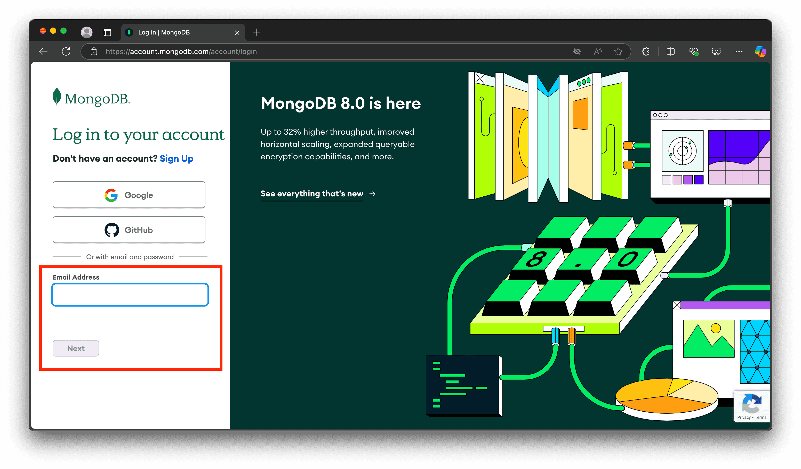
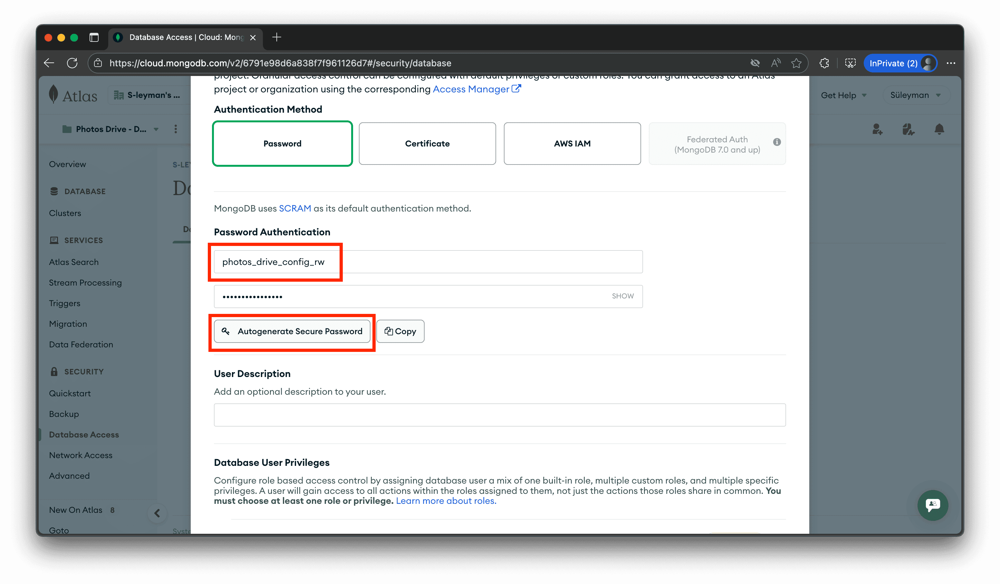

# Store Photos Drive Config on MongoDB

This document outlines how to set up your MongoDB account so that you can use your MongoDB account to store your Photos Drive config.

## Steps

1. Go to <https://www.mongodb.com>, click on the `Sign In` button, and log into your MongoDB account:

    

    

1. Once you're logged in, go to the `Database Access` tab:

    

1. Next, create a Read-Write user to your database, and save the username and password on your notepad:

    

    

    

    

    

1. Then, go to the Connections page:

    

    

1. Finally, obtain the connection string by filling in the username and password from your notepad:

    

1. That's all! That is how you can get your connection string to save your Photos Drive config on MongoDB.
