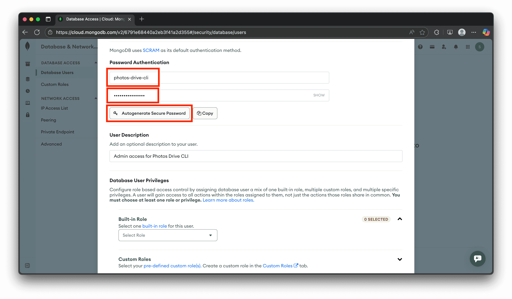
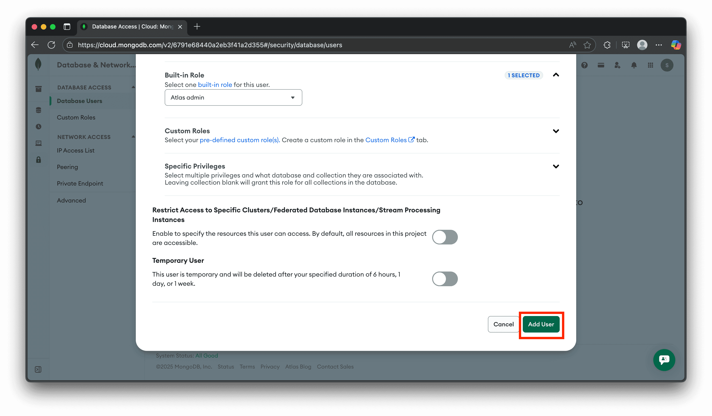
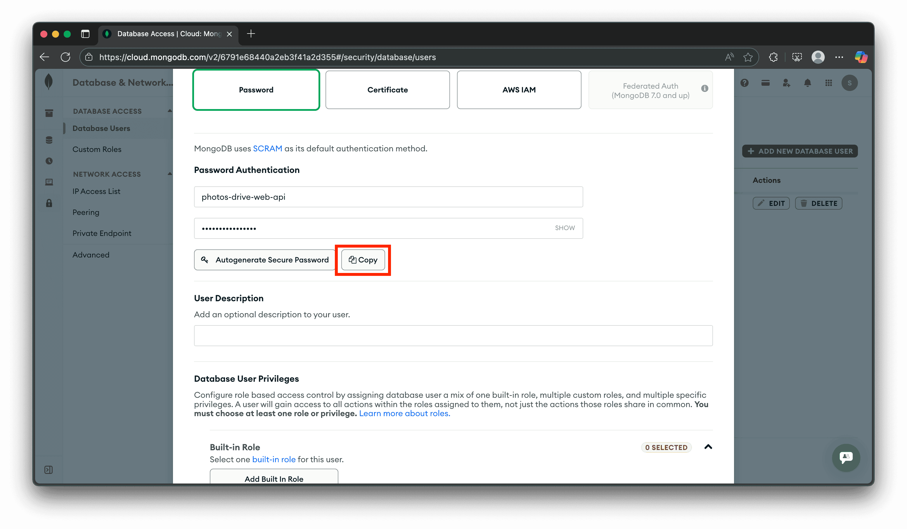
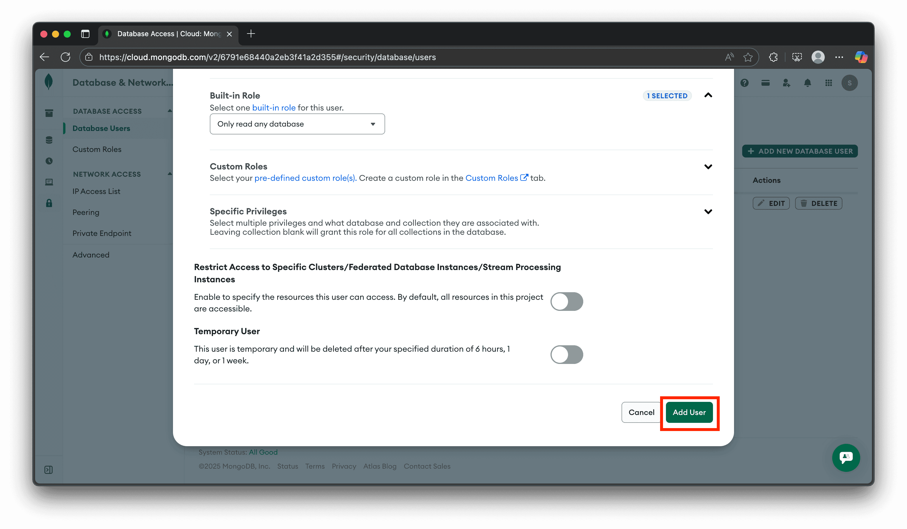

# Store Photos Metadata / Maps / Embeddings on MongoDB

This document outlines how to set up your MongoDB account so that you can use your MongoDB account to store your photo's metadata / maps data / embeddings.

## Steps

1. Go to <https://www.mongodb.com>, click on the `Sign In` button, and log into your MongoDB account:

    

    

1. Once you're logged in, go to the `Database Access` tab:

    

1. Create an admin user for your database, and copy the username and password to your notepad:

    > Note: this is primary used for the CLI, where admin access is needed to know the total size of your database

    

    

    

    

    

1. Create a read-only user for your database, and copy the username and password to your notepad:

    > Note: this is primary used for the web api, where the web api only has read-access to the database

    

    

    

    

    

1. Then, go to the Connections page:

    

    

1. Next, obtain the connection string of your admin user by filling in the username and password of your admin user saved on your notepad:

    

1. Finally, obtain the connection string of your read-only user by repeating the previous step but with the username and password of your read-only user saved on your notepad.

1. That's all! That is how you can get the admin and read-only connection strings of your database to store your photos data on MongoDB.
