# Creating your Google OAuth2 Client

## Description

This document outlines how to create your own OAuth2 client and obtain your client ID and client secrets so that you can authenticate with your Web API

## Steps

1. Go to <https://cloud.google.com/cloud-console> and log into your Google account

2. Create a new project with any name, and select that new project:

   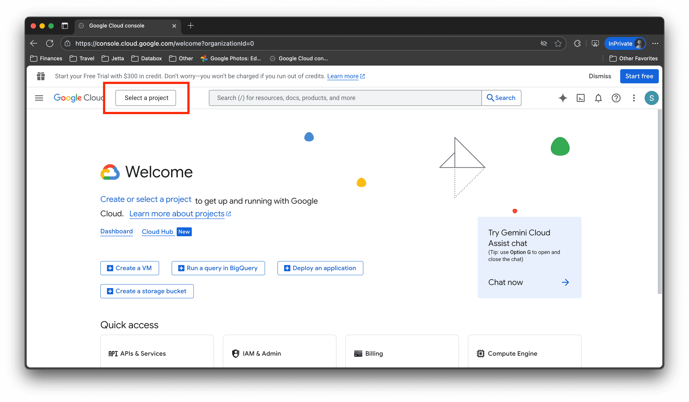

   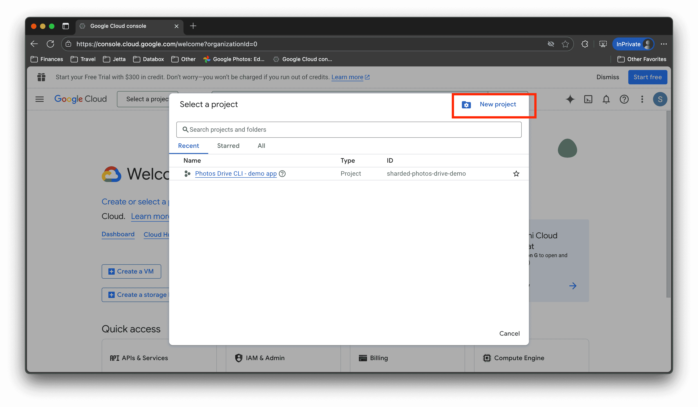

   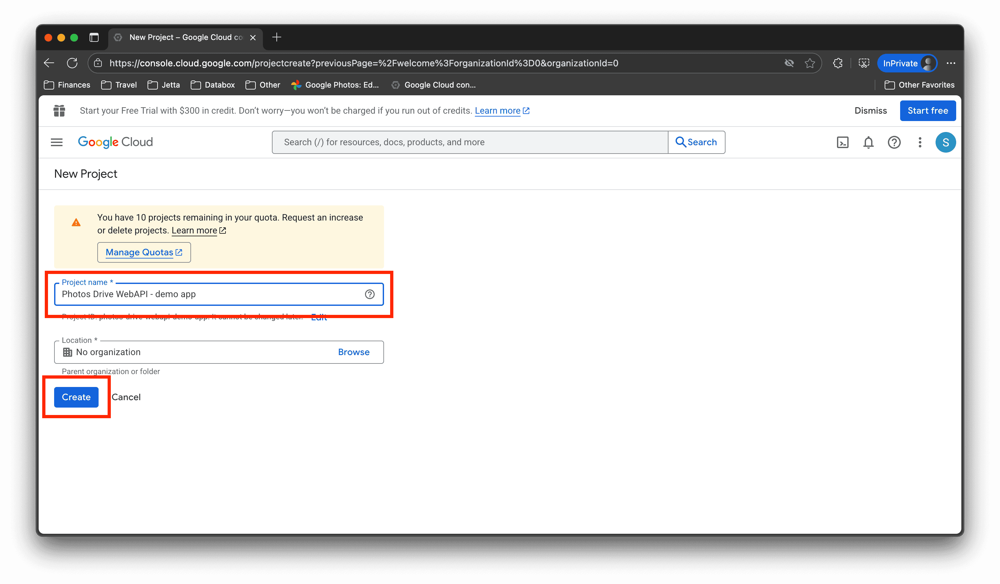

   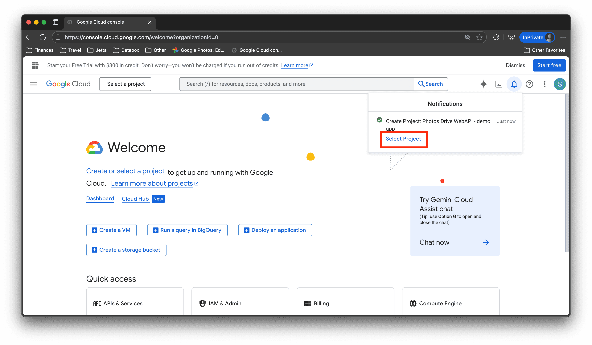

   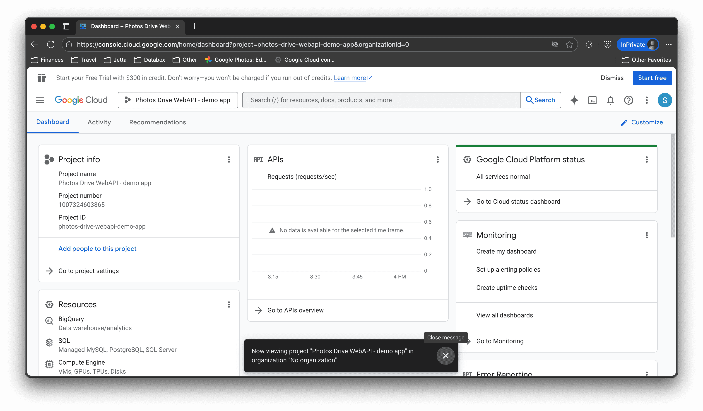

3. Create a new OAuth2 Consent Screen by going to to the APIs and Services tab, creating an External API, and fill in the details:

   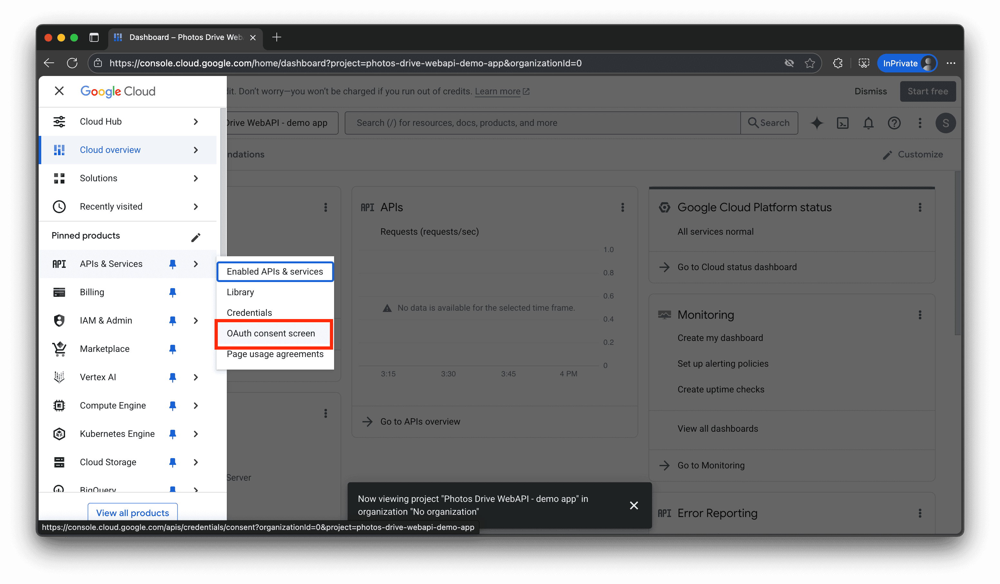

   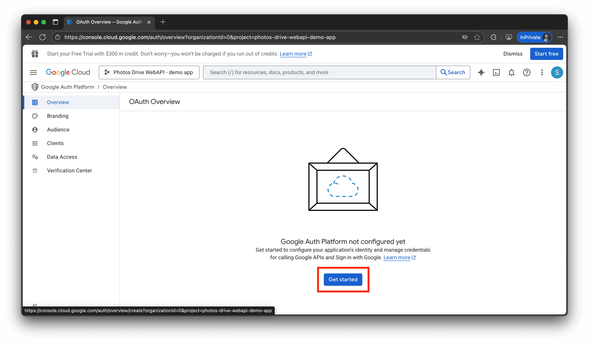

   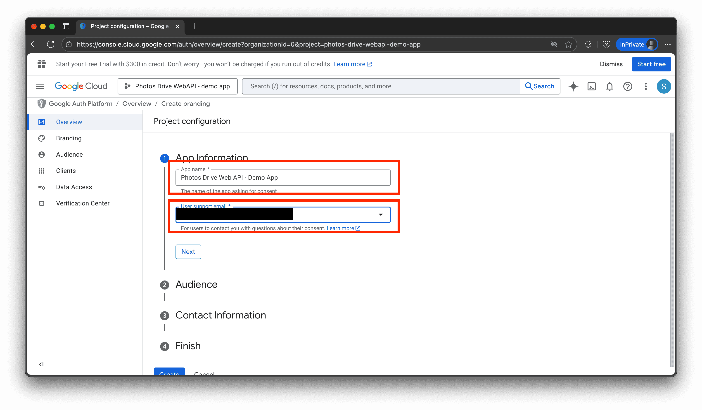

   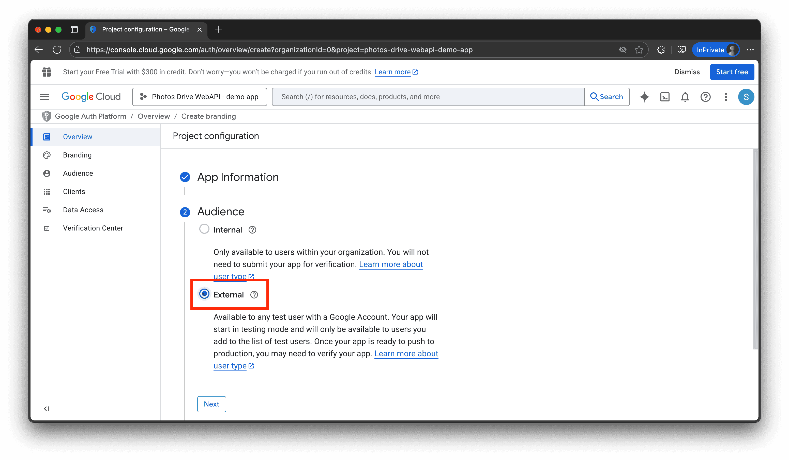

   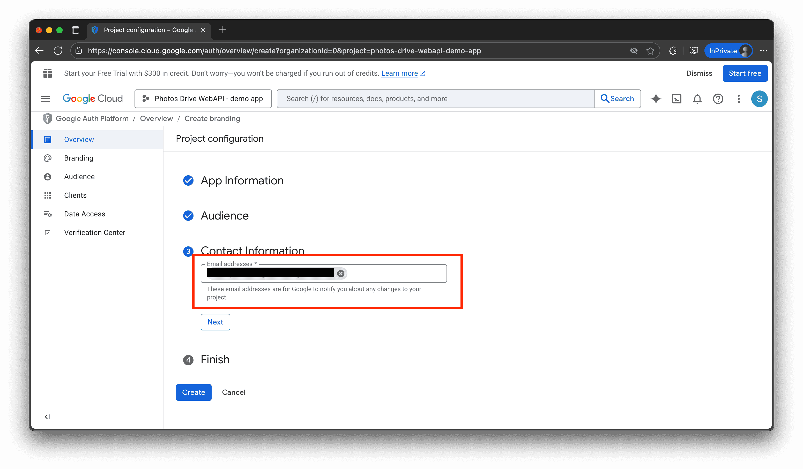

   

4. Create a Web App OAuth2 client. Set `http://localhost:4200` as the authorized JavaScript origins, and `http://localhost:4200/auth/v1/google/callback` as the authorized redirect uri:

   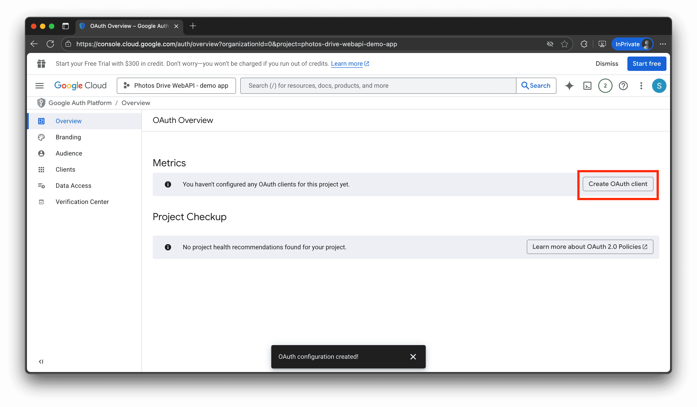

   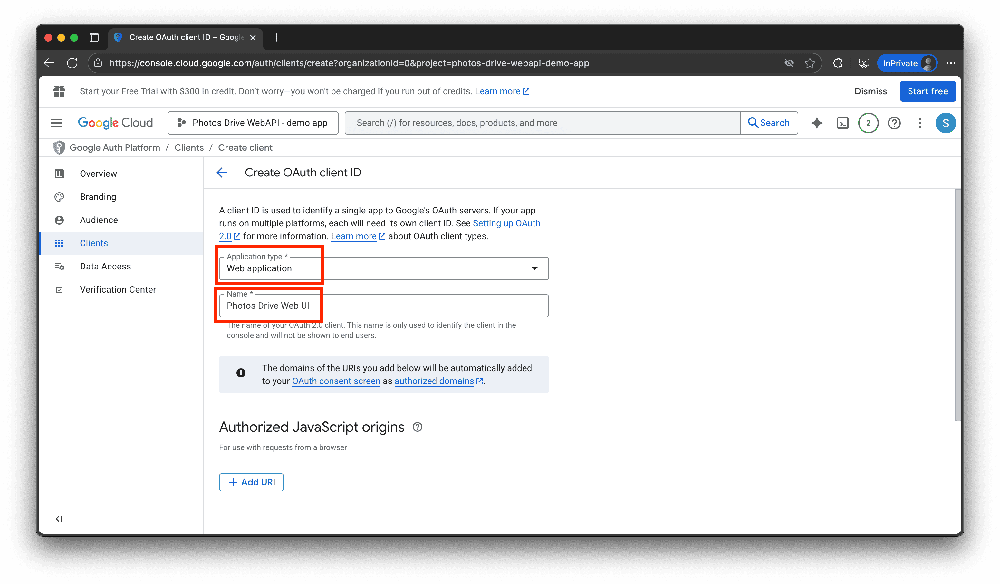

   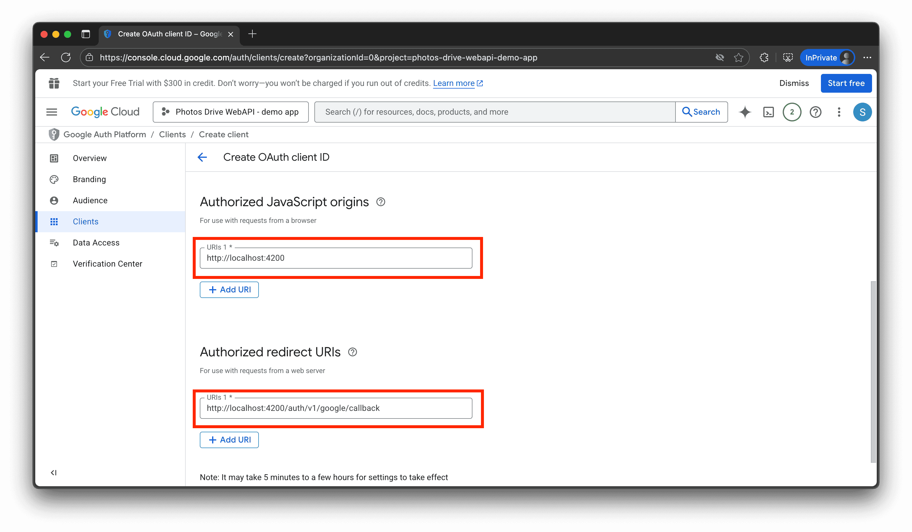

   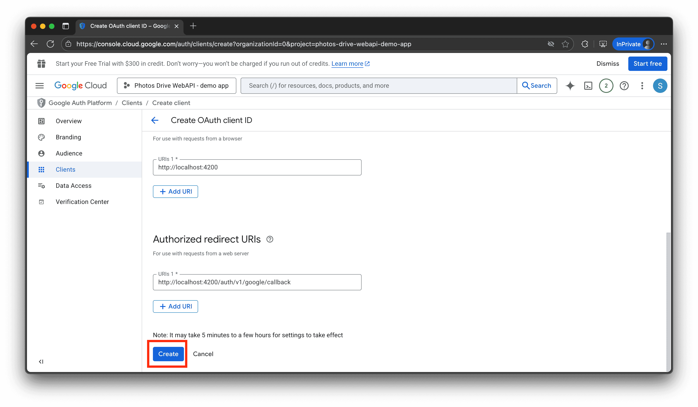

5. A popup will appear. You can see the client ID and client secrets from your JSON file or from the OAuth2 client web page. Save them to your note pad on your computer:

   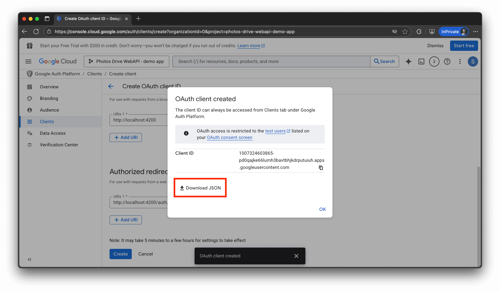

   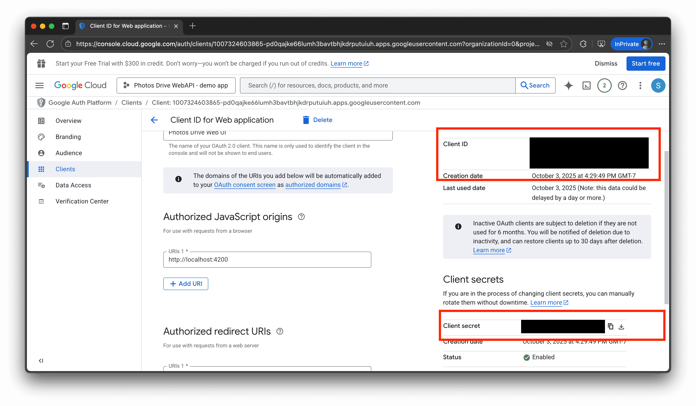
