# Generate Gemini API Key

This document outlines the steps needed to generate a secure Gemini API key.

## Steps

1. First, go to <https://aistudio.google.com> and select `Get API Key`:

    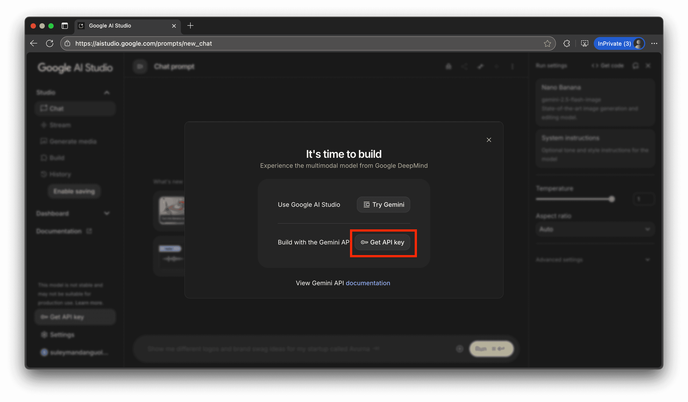

1. Next, create the API key and attach it to your GCP project:

    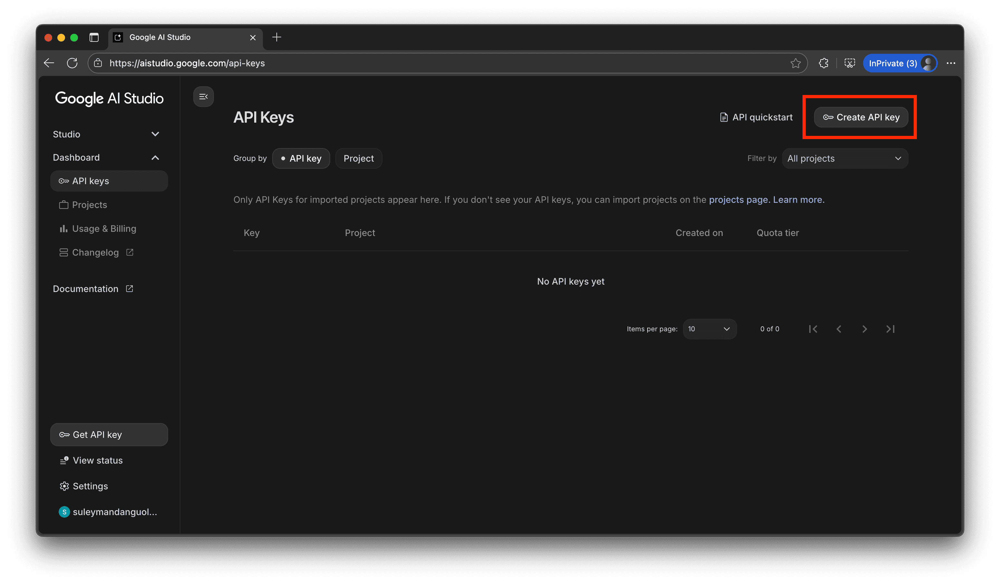

    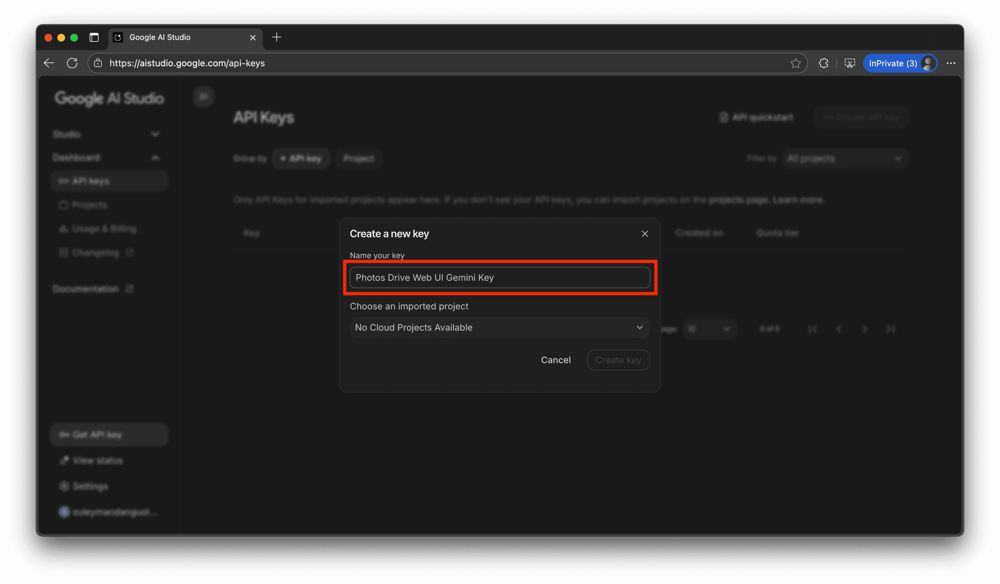

    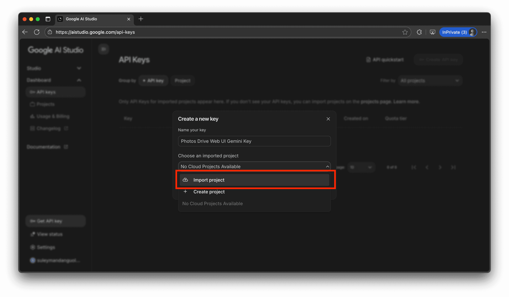

    

    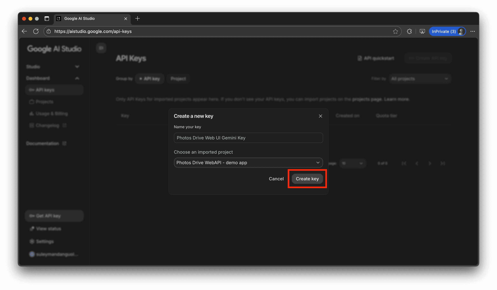

1. Copy the Gemini key to your notepad:

    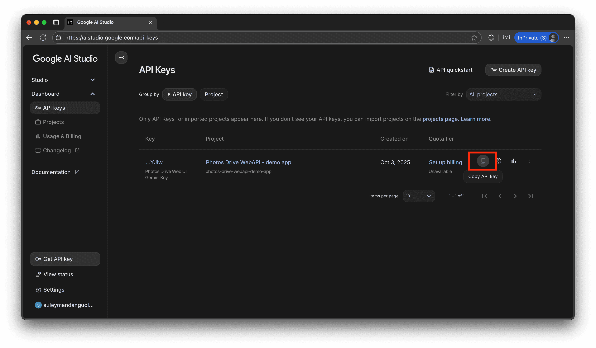

1. Finally, secure your API key by restricting access to your API key from the Photos Drive Web UI's endpoint. This can be done in the <https://console.cloud.google.com> website:

    1. First, go to <https://console.cloud.google.com> and select your project:

    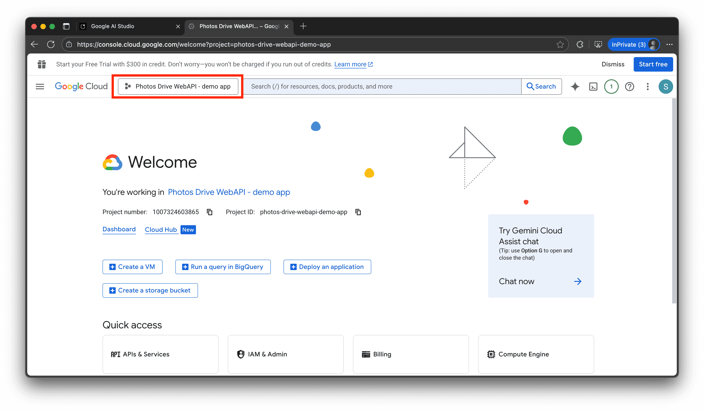

    1. Then, go to the Credentials page:

    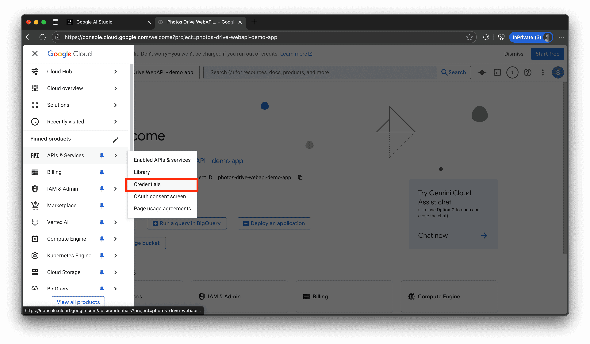

    1. Next, select your Gemini credentials:

    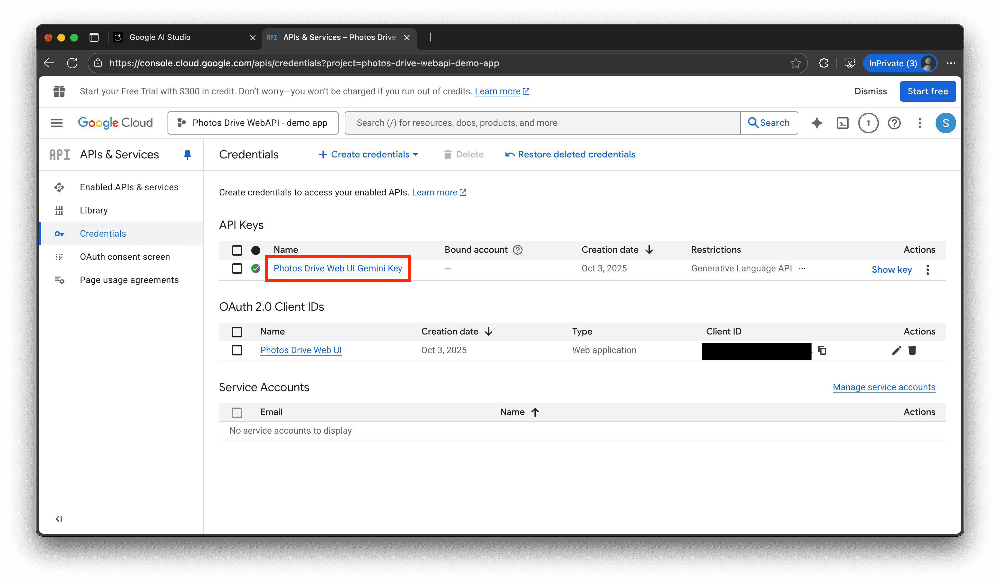

    1. Set the key restriction to only be accessible via the web ui to uri <http://localhost:4200>:

    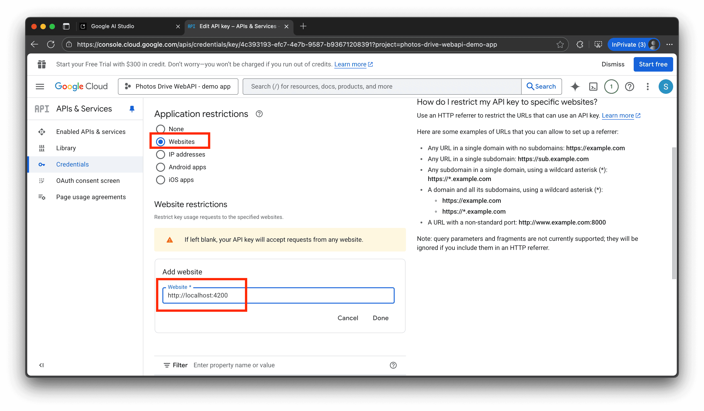

    1. Save the changes:

    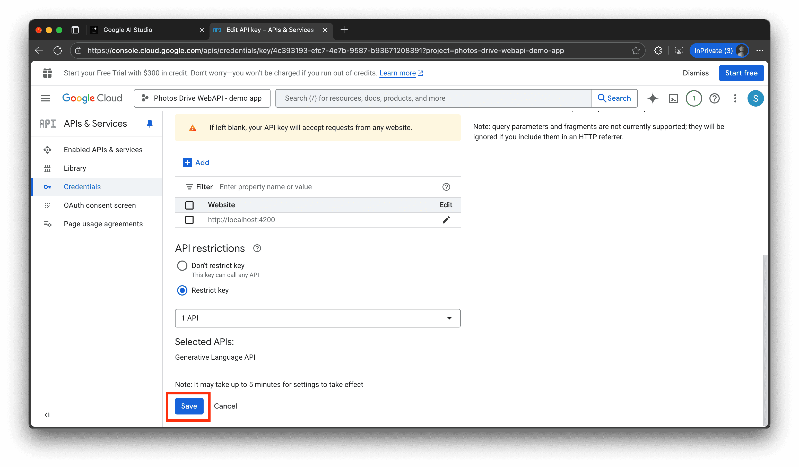

1. You're done! You have created a secure Gemini API key.
